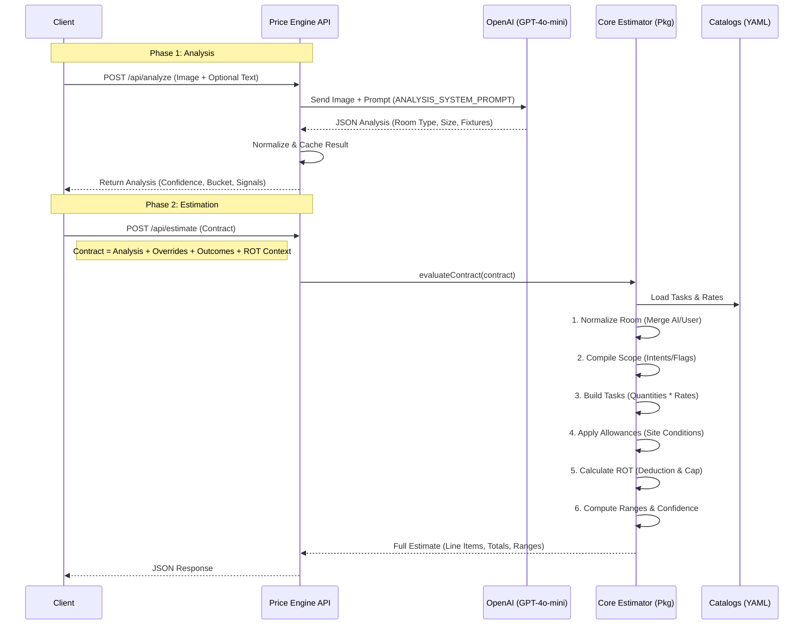

# Price Engine System Specification

> **Status**: Current Code Reality (as of Feb 2026)
> **Service**: `apps/price-engine-service`
> **Package**: `packages/price-engine`

## 1. High-Level Flow Diagram



---

## 2. Public API Surface

### 2.1 `POST /api/analyze`
Generates a "prior" analysis of the room based on an image.

- **Source**: `apps/price-engine-service/src/server.ts`
- **Auth**: None (Public/CORS restricted)
- **Input**:
  ```json
  {
    "image_id": "string", // Referenced from /api/upload
    "optional_text": "string", // User context
    "force": false // Boolean, bypass cache
  }
  ```
- **Output**:
  - `normalized`: Structured analysis (`room_type`, `size_estimate`, `detected_fixtures`, `condition_signals`).
  - `ai_raw`: Raw model output (debugging).
  - `record`: Status tracking.

### 2.2 `POST /api/estimate`
Calculates the definitive price, tasks, and ROT deduction.

- **Source**: `apps/price-engine-service/src/server.ts` delegates to `packages/price-engine/src/contract.ts`
- **Input Schema**: `CanonicalEstimatorContract` (`src/shared/canonicalEstimatorContractSchema.ts`)
  - **Key Sections**:
    - `analysis`: From Phase 1.
    - `overrides`: User corrections (e.g. `bathroom_size_final`).
    - `outcome`: User design choices (tiles, layout change, fixtures).
    - `rot_context`: `{ "owners_count": 1 | 2 }`.
    - `site_conditions`: Elevators, parking, etc.
- **Output Fields (Frontend Dependencies)**:
  - `totals.grand_total_sek` (Gross Total)
  - `total_after_rot_sek` (Net Price to Pay)
  - `rot_deduction_sek` (Deduction Amount)
  - `line_items[]` (List of work items)
  - `price_range_sek` (Uncertainty band: `{ min, max }`)
  - `warnings` (List of potential issues)

Example Request:
```json
{
  "analysis": { ... },
  "overrides": { "bathroom_size_final": "over_7_sqm", "bathroom_size_source": "user_overridden" },
  "outcome": { "shower_type": "walk_in_shower_glass", "layout_change": "yes", ... },
  "rot_context": { "owners_count": 2 }
}
```

---

## 3. Price Estimation Logic

Logic resides in `packages/price-engine/estimator/estimator.ts`.

### 3.1 Line Item Generation
- **Catalog**: Tasks defined in `catalog/tasks.yaml`.
- **Selection**: Tasks are selected based on `flags` (derived from User Intents like "change_layout", "replace_shower") and `selections` (e.g., "microcement" vs "tiles").
- **Quantity Calculation**:
  - **Floor/Wall Area**: Derived from `size_bucket` (e.g., "over_7_sqm" = 7m² floor, 26m² wall) OR User overrides.
  - **Waste factors**: Applied in `estimator.ts` (e.g., `applyMinWaste` adds 10% for cuts).
  - **Formulas**: `computeQuantity` function handles specific logic (e.g., "install_wall_tiles" = wall area - non-tiled area).

### 3.2 Constants (Deterministic)
- **VAT**: All unit prices in `rates.yaml` are **Inclusive of VAT** (implied by typical B2C logic, though variable names like `labor_sek_per_unit` don't explicitly state it, `pricing.ts` confirms standard 25% VAT assumption in V2).
- **Margins**:
  - `project_management_pct`: Applied if complex work (layout change).
  - `contingency_pct`: Global buffer added to subtotal.
  - Defined in `catalog/rates.yaml`.

### 3.3 Range / Uncertainty
- **Logic**: `packages/price-engine/src/contract.ts` -> `computeRangeFromLineItems`
- **Mechanism**:
  - Each trade group has an uncertainty % (e.g. `demolition: 0.09`).
  - Base range is weighted average of these.
  - **narrowed** by: `measurement_confirmed` (-1.5%), `site_conditions_complete` (-1%).
  - **widened** by: `needs_confirmation_ids` (+2%).
  - Result: `min_total_sek` and `max_total_sek`.

---

## 4. ROT Logic (Critical)

Logic is split between `packages/price-engine/estimator/estimator.ts` (eligibility) and `packages/price-engine/src/contract.ts` (calculation).

### 4.1 Variables
- `ROT_RATE`: **30%** (0.3). Configurable via `ROT_RATE` env var.
- `ROT_MAX_SEK`: **50,000 SEK** per owner per year. Configurable via `ROT_MAX_SEK` env.
- `rot_eligible`: Boolean flag on each `TaskLine`, defined in `estimator.ts`.

### 4.2 Algorithm (Pseudocode)
Location: `packages/price-engine/src/contract.ts` -> `computeRotSummary`

```typescript
function computeRot(lineItems, owners_count) {
  // 1. Sum up labor cost for eligible items only
  let eligibleLaborSum = 0;
  for (item of lineItems) {
    if (item.rot_eligible) {
      eligibleLaborSum += item.labor_sek; // (Amounts are VAT inclusive in this context)
    }
  }

  // 2. Calculate Raw Deduction
  let rawDeduction = eligibleLaborSum * 0.30;

  // 3. Apply Cap
  let capLimit = 50000 * owners_count;
  let finalDeduction = Math.min(rawDeduction, capLimit);

  // 4. Net Price
  let netPrice = GrandTotal - finalDeduction;

  return {
    deduction: finalDeduction,
    netPrice: netPrice,
    isCapped: rawDeduction > capLimit
  };
}
```

### 4.3 Edge Cases handled
- **Multiple Owners**: `effectiveMax = 50k * owners`.
- **0 Remaining**: Not explicitly tracked *per user* in backend state (uses stateless `owners_count`). The frontend assumes full capacity unless configured otherwise.
- **Rounding**: `Math.round()` applied at line item step and final deduction step.

---

## 5. Question Generation Logic

The "Questions" are primarily **Need Confirmations** (`NC-xxx`) logic, not LLM generations.

### 5.1 Rules Engine
- **Source**: `packages/price-engine/estimator/estimator.ts` -> `computeNeedsConfirmations`.
- **Logic**:
  - If `floor_area_m2` missing -> `NC-001`.
  - If `wet_zone_wall_area` < `wall_area` (partial) -> `NC-002`.
  - If `change_layout` is true -> `NC-003`.
  - If `building_year` < 1980 -> `NC-004` (Asbestos/Lead check).
- **Frontend Mapped**: The frontend sees these IDs and displays specific modals/questions.

### 5.2 AI Analysis
- **Source**: `server.ts` -> `analyzeWithAi`.
- **Model**: `gpt-4o-mini` (default).
- **Prompt**: `ANALYSIS_SYSTEM_PROMPT`.
- **Output**: JSON.
- **Validation**: Zod schema `aiAnalysisV2Schema`. Retries are not currently implemented in `server.ts` (only validation error logging).

---

## 6. Analysis Step

This step converts a user image into a "Prior Belief" for the estimate.

- **Endpoint**: `/api/analyze`
- **Output**:
  - `bathroom_size_estimate`: Bucket (e.g. `over_7_sqm`).
  - `detected_fixtures`: `{ shower_present: true, ... }`.
  - `condition_signals`: `overall_condition` (good/average/poor).
- **Influence**:
  - These values feed into the **Choice Configurator** default selections.
  - They also set the default quantities if the user doesn't override measurements.

---

## 7. Determinism & Stability

- **Deterministic**: The `estimate()` function (Pricing) is **purely deterministic**. Given the same input contract, it returns the exact same SEK values.
- **Non-Deterministic**: The `/api/analyze` (AI) step is non-deterministic.
  - **Mitigation**:
    - `temperature: 0.2` (Low randomness).
    - Caching: Results are cached by `image_id` on disk/volume (see `ANALYSIS_CACHE_DIR` in `server.ts`).
    - Conservative Prompting: Instructions like "fill with conservative defaults when unsure".

---

## 8. Observability

- **Logs**:
  - `[estimate]`: Request ID, Origin.
  - `[PERF_ESTIMATE]`: Timing for validate/adapt/compute steps.
  - `[DEBUG_ESTIMATE]`: Hash, Buckets, Totals.
- **Locations**: `server.ts` (around lines 285-303).
- **Metrics**: No external accumulation (e.g. Prometheus) visible in code, just stdout logs.

---

## 9. Known Limitations / TODOs

1.  **Monolithic Server**: `server.ts` is 1000+ lines mixing HTTP, business logic, and AI handling.
2.  **Duplicate ROT Logic**: `src/lib/pricing.ts` contains a newer/better V2 ROT logic (with rss variance) that is largely unused by the main `contract.ts` flow.
3.  **Hardcoded Rates**: Rates are loaded from YAML, but some "allowance" logic (e.g. `wallHungAllowance`) has hardcoded logic in `estimator.ts` enabling/disabling tasks.
4.  **Implicit VAT**: Variable names often don't specify `_incl_vat` vs `_ex_vat`, leading to reliance on convention (Consumer = Incl VAT). V2 tries to fix this with explicit suffix naming.
5.  **Error Handling**: AI failures (`422`, `502`) in `analyze` are basic; no automatic retry loop for JSON parsing errors (as per recent task discussions).

---

## Verification Checklist

Use these commands to verify behavior matches strict requirements:

- [ ] **Verify Estimate & ROT (1 Owner)**
  ```bash
  curl -X POST http://localhost:3000/api/estimate \
    -H "Content-Type: application/json" \
    -d '{
      "analysis": { "room_type": "bathroom", "bathroom_size_estimate": "over_7_sqm", "bathroom_size_confidence": 0.9, "detected_fixtures": {}, "layout_features": {}, "ceiling_features": {}, "condition_signals": { "overall_condition": "average" }, "image_quality": { "sufficient_for_estimate": true, "issues": [] }, "analysis_confidence": 0.9 },
      "overrides": { "bathroom_size_final": "over_7_sqm", "bathroom_size_source": "user_overridden" },
      "outcome": { "shower_type": "walk_in_shower_glass", "bathtub": "yes", "toilet_type": "wall_hung", "vanity_type": "vanity_with_cabinet", "wall_finish": "large_format_tiles_all_walls", "floor_finish": "large_format_tiles", "ceiling_type": "moisture_resistant_panels", "layout_change": "yes", "shower_niches": "one" },
      "rot_context": { "owners_count": 1 }
    }' | jq '.estimate.rot_summary'
  ```
  *Expect*: `rot_cap_sek: 50000`

- [ ] **Verify Estimate & ROT (2 Owners)**
  *Request*: Change `"rot_context": { "owners_count": 2 }`
  *Expect*: `rot_cap_sek: 100000` (and `rot_deduction_sek` likely higher if cap was hit).

- [ ] **Verify Analysis (AI)**
  *Note*: Requires valid `image_id` from upload or mocking.
  ```bash
  curl -X POST http://localhost:3000/api/analyze \
    -H "Content-Type: application/json" \
    -d '{ "image_id": "test-id", "force": true }'
  ```
